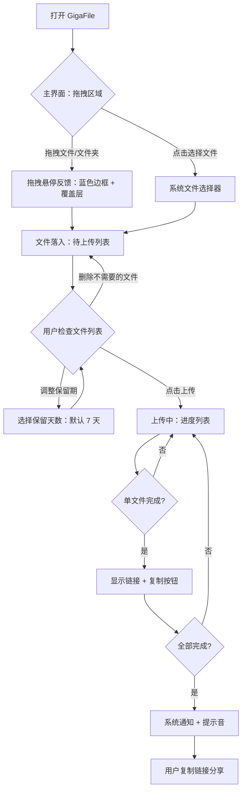
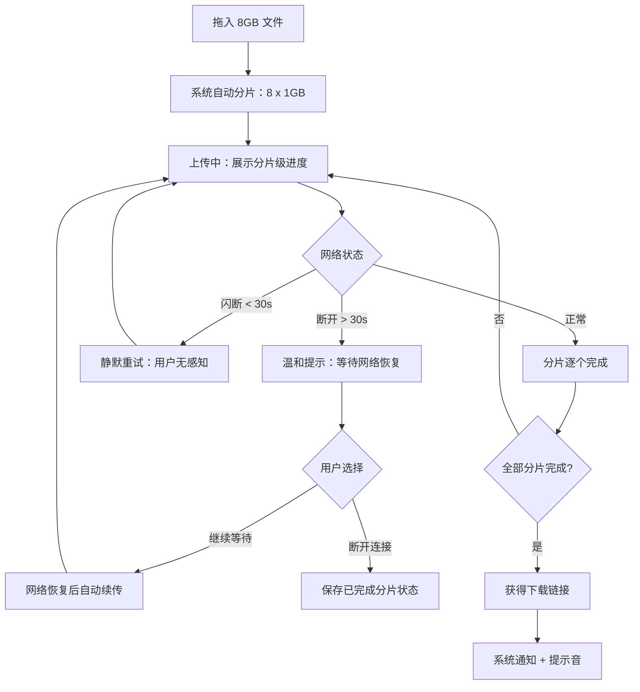
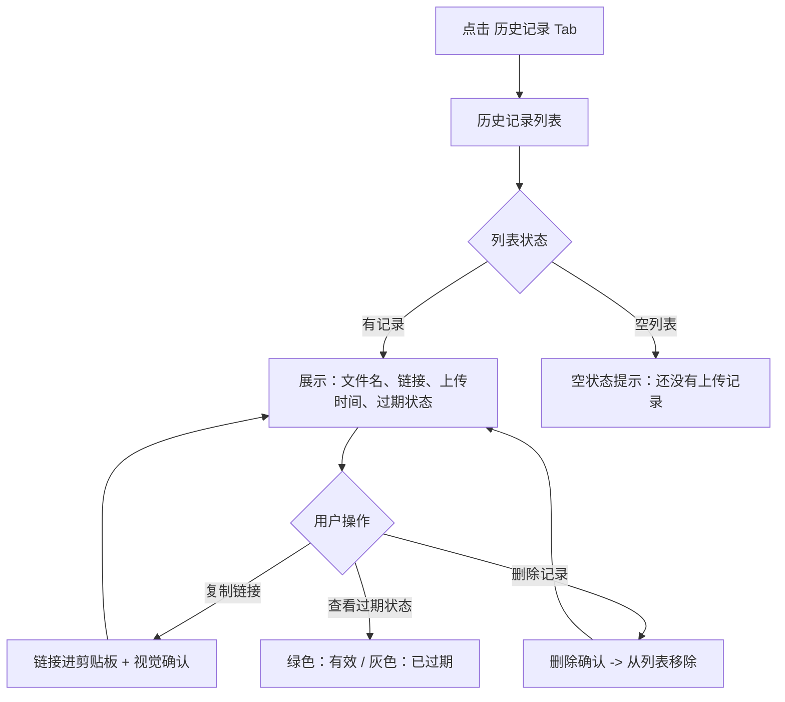

# UX Design Specification - giga-file-uploader

**Author:** Shaoyoko
**Date:** 2026-02-10

---

## Executive Summary

### Project Vision

GigaFile 是 gigafile.nu 的桌面级替代上传前端，目标是用"稳定、自动、干净"三个关键词彻底取代官方 Web 版的上传体验。产品形态为 Tauri (Rust + React) 跨平台桌面应用，核心交互模型为"拖入文件 -> 点上传 -> 拿链接"的三步闭环。

产品设计哲学：替用户扛下所有技术麻烦。网络抖动、分块策略、重试逻辑——全部后台自动处理，用户界面只呈现"进度在走"和"链接可拿"两个状态。

### Target Users

**主要用户：** 开发者本人及身边朋友——日常使用 gigafile.nu 分享文件的人群。

**用户特征：**
- 技术素养中等偏上，但对上传工具的期望是"零学习成本"
- 使用场景：日常工作中需要发送设计稿、视频素材、项目文件等给合作方
- 核心诉求：稳定可靠，不再被断传和广告折磨
- 使用设备：macOS / Windows 桌面端
- 使用频率：不固定，但每次使用都希望快速完成

**用户画像参考（来自 PRD 旅程）：**
- 小田型用户：多文件日常分享，关注效率和链接管理
- 阿翔型用户：大文件上传，关注稳定性和进度可见性

### Key Design Challenges

1. **进度可视化的信息密度平衡：** 分片/分块/线程等技术概念不能暴露给用户，但用户需要足够的进度信息获得信心。需要设计分层的进度展示——常规文件展示整体进度，大文件提供分片级可见性，且表达方式必须直觉化。

2. **错误处理的隐形设计：** 产品的核心差异化之一是"静默重试"。50 次以下用户无感知、超过阈值才提示——这种模式需要精心设计状态机和视觉过渡，避免从"一切正常"到"出问题了"的跳跃感。

3. **工具型产品的信任感建立：** 作为自用工具，界面需要极简但不简陋。用户把重要文件托付给这个应用，需要通过视觉设计传达可靠性和专业感。

### Design Opportunities

1. **极致拖拽体验：** 官方 Web 版拖拽体验差是核心痛点，GigaFile 可以通过大面积拖拽热区、即时视觉反馈、文件夹递归零配置等设计，让用户在第一次使用就感受到明显的体验升级。

2. **"发件箱"式链接管理：** 将历史记录设计为用户心智中的"发件箱"，链接过期状态一目了然，复制操作一键完成，建立用户对链接生命周期的直觉认知。

3. **工具箱扩展预留：** MVP 阶段通过导航框架的预留设计（如可收起的侧边栏），暗示产品的成长潜力，为未来插件式工具接入做好 UX 层面的准备。

## Core User Experience

### Defining Experience

**一句话定义：** "拖进去，撒手不管，拿链接。"

GigaFile 的核心体验是让文件上传这件事变得像把文件扔进垃圾桶一样自然——用户唯一需要做的决策是"这些文件要不要传"，其余一切由系统接管。

**核心体验优先级：**
1. **拖入的瞬间**（最高优先级）——这是用户从官方 Web 版迁移过来后的第一个触点，必须在 0.5 秒内让用户感受到"这比网页好太多了"
2. **上传过程中的安心感**——进度在走，一切可控，不需要盯着看
3. **拿到链接时的满足感**——一键复制，干净利落

### Platform Strategy

**平台：** Tauri 2.x 桌面应用（macOS + Windows）
**输入方式：** 鼠标/键盘为主，触控板为辅
**网络依赖：** 上传功能依赖网络，但应用本身离线可用（查看历史、管理队列）
**系统集成：** 系统通知（上传完成）、系统提示音、原生文件选择器
**不做：** 右键菜单集成、文件关联、开机启动、托盘常驻

### Effortless Interactions

以下交互必须做到"零思考成本"：

1. **文件输入：** 拖拽是第一公民。窗口的绝大部分区域都是有效拖拽目标，用户不需要精准瞄准一个小框。文件夹拖入自动递归，混合拖入（散文件+文件夹）自动处理，用户不需要做任何预处理。
2. **上传启动：** 文件进入待上传列表后，一个"上传"按钮，点一下就走。保留期默认值合理（建议默认 7 天），用户大部分时候不需要调整。
3. **链接获取：** 每个文件上传完成后，链接旁边就是复制按钮，点一下进剪贴板。不需要打开新页面，不需要确认对话框。
4. **错误恢复：** 自动的。用户不需要知道发生了什么，不需要点重试。

### Critical Success Moments

1. **首次拖入文件的瞬间：** 文件落入窗口，待上传列表即时出现文件名和大小——用户立刻知道"它接住了"。这是建立信任的第一个 0.5 秒。
2. **上传完成的通知：** 系统通知弹出 + 提示音响起，用户从其他工作窗口切回来，链接已经在那里等着。这是"撒手不管"承诺的兑现时刻。
3. **大文件上传中途网络恢复：** WiFi 闪断几秒后恢复，用户什么都没看到，进度条继续走——用户事后才意识到"原来中间断过网"。这是"稳定"这个关键词的具象体现。

### Experience Principles

1. **隐形可靠：** 技术复杂性对用户完全透明。分片、并发、重试——用户看到的只是一根平稳推进的进度条。
2. **即时反馈：** 每一个用户动作都有即时视觉回应。拖入有动画，上传有进度，完成有通知，复制有确认。
3. **最少决策：** 用户需要做的决策越少越好。合理的默认值覆盖 90% 的场景，高级选项存在但不主动干扰。
4. **工具本色：** GigaFile 是工具，不是平台。即开即用，用完就走，不留恋用户的注意力。

## Desired Emotional Response

### Primary Emotional Goals

- **安心感（Primary）：** "我的文件在安全地传输，我不需要担心任何事情。" 这是对 gigafile.nu 官方 Web 版焦虑体验的直接对冲。
- **掌控感（Secondary）：** "我随时知道发生了什么，但不需要做任何事。" 进度可见但不需要干预。
- **干净利落（Tertiary）：** "这个工具不浪费我一秒钟。" 没有广告，没有多余步骤，没有需要关闭的弹窗。

### Emotional Journey Mapping

| 阶段 | 目标情绪 | 设计手段 |
|------|---------|---------|
| 首次打开应用 | 清爽、直觉 | 大拖拽区，零引导，界面自解释 |
| 拖入文件 | 即时满足 | 流畅的拖拽动画，文件列表即时呈现 |
| 点击上传 | 信心、放手 | 进度条平稳启动，可以安心切窗口 |
| 等待上传中 | 安心、无感 | 后台静默工作，完成后通知唤回 |
| 拿到链接 | 满足、高效 | 一键复制，零额外操作 |
| 网络异常 | 不慌、信任 | 静默重试，用户无感知；长时间断开才温和提示 |
| 回来查链接 | 方便、清晰 | 历史记录清晰，过期状态一目了然 |

### Micro-Emotions

- **信心 > 困惑：** 每个界面状态都自解释，用户永远知道"现在该做什么"
- **信任 > 怀疑：** 进度条的平稳推进不断积累信任资本
- **满足 > 焦躁：** 上传完成的提示音是小小的奖励信号
- **从容 > 焦虑：** 即使出错，用户看到的也是温和的提示而非恐慌的红色警报

### Design Implications

- **安心感** -> 进度条使用柔和的蓝/绿色系，平稳动画，避免闪烁或跳动
- **掌控感** -> 关键状态信息始终可见（上传中文件数、已完成数、整体进度百分比），但不喧宾夺主
- **干净利落** -> 界面元素最少化，每个像素都为功能服务，无装饰性元素
- **避免焦虑** -> 错误提示使用中性色调（琥珀色/橙色），措辞温和（"网络连接中断，等待恢复中..."而非"上传失败！"）

### Emotional Design Principles

1. **沉默是金：** 系统正常运行时，不打扰用户。没有 toast 弹窗告诉你"重试成功了"——因为用户根本不需要知道重试过。
2. **温和告警：** 只有真正需要用户决策时才出现提示，且措辞始终站在用户角度（"等待网络恢复"而非"HTTP 连接超时"）。
3. **庆祝完成：** 上传完成是唯一值得"庆祝"的时刻——提示音 + 系统通知 + 界面状态更新，三层反馈让用户不会错过。

## UX Pattern Analysis & Inspiration

### Inspiring Products Analysis

**1. WeTransfer（文件传输）**
- 核心优势：极简上传界面，拖拽即传，无需注册
- UX 亮点：全屏拖拽区域、动态背景艺术品、进度可视化简洁直觉
- 可借鉴：大面积拖拽热区的设计语言，"上传完成 -> 获取链接"的线性流程

**2. Raycast（桌面工具）**
- 核心优势：即开即用的工具感，极简但不简陋
- UX 亮点：快捷键唤起、操作即时响应、视觉密度恰到好处
- 可借鉴：桌面工具类应用的"轻量但可靠"气质，信息密度的拿捏

**3. Linear（项目管理）**
- 核心优势：现代桌面应用的视觉标杆，操作流畅无卡顿
- UX 亮点：键盘优先交互、深色/浅色主题、状态过渡动画丝滑
- 可借鉴：界面质感和动画品质的参考标准，证明工具类应用也可以有高级感

### Transferable UX Patterns

**拖拽交互模式（来自 WeTransfer）：**
- 全窗口作为拖拽目标，悬停时整个区域变色反馈
- 文件落入后即时展示文件列表，无需二次确认

**进度展示模式（来自 macOS Finder 复制）：**
- 整体进度用一根主进度条
- 展开/收起看每个文件的独立进度
- 大文件自动展示分片级进度，小文件只显示整体进度

**一键操作模式（来自 Raycast）：**
- 复制链接 = 点一下按钮，没有中间步骤
- 操作完成用短暂的视觉反馈（按钮变为勾号 1 秒后恢复）

### Anti-Patterns to Avoid

1. **避免 gigafile.nu 官方的"广告包围"模式：** 界面中不应有任何与核心功能无关的视觉元素
2. **避免多步确认对话框：** 不要在上传前弹出"你确定要上传吗？"——用户拖进来就是要传
3. **避免技术术语暴露：** 不要在界面中出现"分块大小"、"并发线程数"等概念。设置面板可以有，但不应出现在主流程中
4. **避免强制引导/教程：** 目标用户不需要被教如何拖拽文件

### Design Inspiration Strategy

**采纳：**
- WeTransfer 的全屏拖拽区域设计语言
- Raycast 的"即开即用"工具气质
- macOS 原生的分层进度展示模式

**适配：**
- Linear 的视觉品质——降低到适合工具类应用的密度，不需要那么"设计感"
- WeTransfer 的背景艺术——不做装饰性背景，但保留空状态时的视觉引导（大面积拖拽提示）

**避免：**
- 任何需要注册/登录的流程
- 任何模态对话框打断主流程
- 任何非必要的设置暴露

## Design System Foundation

### Design System Choice

**选择：Tailwind CSS + Headless UI 组件 + 自定义设计 Token**

这是一个"可主题化系统"方案——Tailwind 提供原子化样式基础，Headless UI（如 Radix UI）提供无样式但功能完备的交互组件，自定义设计 Token 确保视觉一致性。

### Rationale for Selection

1. **速度与灵活性平衡：** 单人开发，需要快速出界面，但又不想被 Material UI / Ant Design 的视觉风格锁定。Tailwind 让你完全控制外观，同时提供极高的开发效率。
2. **Tauri + React 生态契合：** Tailwind CSS 与 React 组件模型天然契合，Radix UI 提供的 Headless 组件（Dialog、Dropdown、Toast 等）在 Tauri WebView 中表现良好。
3. **轻量：** 不引入重量级 UI 框架，保持应用包体小、启动快——这对桌面工具类应用至关重要。
4. **学习 React 的最佳实践：** 用户正在从 Vue 转学 React，Tailwind + Radix 是 React 生态中的主流组合，学习价值高。

### Implementation Approach

- **样式层：** Tailwind CSS 4.x，使用 `@theme` 定义设计 Token（颜色、间距、圆角等）
- **交互组件：** Radix UI Primitives（Dialog、DropdownMenu、Toast、Progress、Tooltip）
- **图标：** Lucide React（与 Radix 生态一致，轻量 Tree-shakable）
- **动画：** Tailwind 内置过渡 + Framer Motion（拖拽动画、进度条过渡）

### Customization Strategy

- 通过 Tailwind 的 `@theme` 层定义所有设计 Token，实现全局主题切换能力
- 后续 Phase 3 的深色/浅色主题切换只需切换 Token 集
- 自定义组件基于 Radix Primitives 封装，保持无障碍能力的同时完全控制外观

## 2. Core User Experience

### 2.1 Defining Experience

**GigaFile 的定义性体验：** "把文件扔进窗口，下次想起来时链接已经在那了。"

类比知名产品的定义性体验：
- Tinder: "左滑右滑选人"
- AirDrop: "靠近就能传"
- **GigaFile: "扔进去就完事"**

这个定义性体验的关键在于：用户的认知负担在"拖入文件"的那一刻就结束了。后续的一切——分片、上传、重试、拿链接——都是系统自动完成的。

### 2.2 User Mental Model

**用户的心智模型：** "这是一个桌面版的 gigafile.nu，但不会断、不会卡、没有广告。"

用户带着 gigafile.nu 网页版的使用经验来到 GigaFile：
- 他们知道文件会被上传到 gigafile.nu 的服务器
- 他们知道会得到一个可以分享的链接
- 他们知道链接有过期时间
- 他们**不知道**（也不需要知道）分片、并发、重试这些技术概念

**现有方案的痛点（用户已经忍受的）：**
- 网页版传到一半断掉，只能从头来
- 广告干扰视觉焦点
- 拖拽区域太小，经常拖不准
- 传完后链接在一堆广告中间，找起来费劲

**GigaFile 不改变心智模型，只改善执行体验。** 用户不需要学习新概念，他们做的事情和以前一样（传文件、拿链接），只是过程变得可靠和干净了。

### 2.3 Success Criteria

- 用户说"这就是能用的"——零学习成本，打开就知道怎么用
- 进度条从不回退、从不卡住——即使后台在重试，用户看到的也是持续推进
- 链接复制到剪贴板的反馈不超过 200ms——点击 -> 视觉确认 -> 完成
- 首次使用到完成第一次上传不超过 3 步操作
- 上传 8GB 文件的过程中，用户可以安心离开去做其他事

### 2.4 Novel UX Patterns

GigaFile 主要使用**成熟的 UX 模式**，不需要用户学习新交互：

- **拖拽上传：** 成熟模式，用户已有预期
- **进度条：** 成熟模式，但做了分层优化（小文件单条、大文件多条）
- **一键复制：** 成熟模式，点击即复制到剪贴板
- **列表管理：** 成熟模式，增删查改

**唯一的微创新——自适应进度密度：**
- 小文件（< 1GB）：只展示一根整体进度条
- 大文件（>= 1GB，多分片）：自动展开分片级进度视图，每个分片一根子进度条
- 用户不做选择，系统根据文件大小自动决定展示密度

### 2.5 Experience Mechanics

**1. 启动（Initiation）：**
- 用户打开 GigaFile，看到一个干净的窗口，中央是大面积拖拽区域，提示文案"将文件拖到这里，或点击选择文件"
- 拖拽区域占据主内容区 80% 以上面积
- 顶部有简洁的 Tab 导航：[上传] [历史记录]

**2. 文件输入（Input）：**
- 拖拽文件到窗口任意位置 -> 窗口整体变色（蓝色边框 + 半透明覆盖层）表示"我接住了"
- 文件落入后，拖拽区域收缩为顶部小条，主区域变为待上传文件列表
- 文件列表展示：文件名、大小、删除按钮
- 底部固定区域：保留期选择（默认 7 天）+ [上传] 按钮

**3. 上传中（Processing）：**
- 点击上传后，文件列表变为上传进度列表
- 每个文件显示：文件名、进度条、进度百分比、当前状态（上传中/已完成/等待中）
- 大文件自动展开分片视图（可折叠）
- 用户可以切到其他窗口，上传在后台继续

**4. 完成（Completion）：**
- 单个文件上传完成：进度条变为绿色 + 显示链接 + [复制] 按钮
- 全部完成：系统通知 + 提示音
- 点击 [复制]：按钮短暂变为勾号图标（1 秒后恢复），链接进入剪贴板

## Visual Design Foundation

### Color System

**设计方向：** 冷静专业，不花哨。以中性色为主体，功能色点缀。

**主色系：**
- **Primary（品牌蓝）：** `#3B82F6`（Tailwind blue-500）——用于主要操作按钮、进度条、激活状态
- **Background（主背景）：** `#FAFAFA`（浅灰白）——干净通透，不刺眼
- **Surface（卡片/面板）：** `#FFFFFF`（纯白）——内容区域
- **Text Primary：** `#1A1A1A`（近黑）——主文字
- **Text Secondary：** `#6B7280`（灰色）——辅助信息
- **Border：** `#E5E7EB`（浅灰）——分割线、边框

**功能色：**
- **Success：** `#10B981`（绿色）——上传完成
- **Warning：** `#F59E0B`（琥珀色）——温和告警（网络中断等待）
- **Error：** `#EF4444`（红色）——仅用于真正的失败（极少出现）
- **Info：** `#6366F1`（靛蓝）——提示信息

**拖拽交互色：**
- 拖拽悬停边框：`#3B82F6`（品牌蓝）+ 20% 透明度覆盖层
- 拖拽区域默认：虚线边框 `#D1D5DB` + 浅灰背景

**对比度合规：** 所有文字/背景组合满足 WCAG AA 标准（4.5:1 对比度）。

### Typography System

**字体选择：**
- **主字体：** 系统字体栈 `-apple-system, BlinkMacSystemFont, 'Segoe UI', sans-serif`
  - 原因：原生感、零加载延迟、跨平台一致、中日文渲染最优
- **等宽字体（链接/文件路径）：** `'SF Mono', 'Cascadia Code', 'Consolas', monospace`

**字号层级：**
- **标题 H1：** 24px / 1.3 行高 / 600 字重——页面标题（极少使用）
- **标题 H2：** 18px / 1.4 行高 / 600 字重——区域标题
- **正文 Body：** 14px / 1.5 行高 / 400 字重——主要内容文字
- **辅助 Caption：** 12px / 1.4 行高 / 400 字重——文件大小、时间戳等辅助信息
- **按钮 Button：** 14px / 1.0 行高 / 500 字重——操作按钮文字

**设计原则：** 工具类应用不需要大标题和装饰性排版。信息密度优先，确保扫一眼就能获取关键信息。

### Spacing & Layout Foundation

**间距基准单位：** 4px

**间距层级：**
- `xs`: 4px — 图标与文字间距、紧凑元素内边距
- `sm`: 8px — 列表项内部元素间距
- `md`: 12px — 组件内边距
- `lg`: 16px — 区域间距、卡片内边距
- `xl`: 24px — 主要区域分隔
- `2xl`: 32px — 页面级间距

**布局结构：**
- **窗口默认尺寸：** 720px x 560px（可调整大小，最小 600px x 480px）
- **主布局：** 单栏布局，顶部导航 Tab（上传 / 历史记录）
- **MVP 不使用侧边栏：** 只有两个页面（上传、历史），Tab 切换足够。侧边栏留给 Phase 3 工具箱扩展
- **内容区域内边距：** 24px（左右）、16px（上下）
- **文件列表项高度：** 48px（单行）/ 自适应（大文件展开分片时）

**布局原则：**
- 内容紧凑但不拥挤——工具类应用的信息密度
- 垂直节奏一致——列表项等高，间距均匀
- 操作按钮靠右对齐——符合 LTR 阅读习惯中"行动在右"的心智模型

### Accessibility Considerations

- **颜色对比度：** 所有文字/背景组合满足 WCAG AA（4.5:1），大文字满足 3:1
- **键盘导航：** 所有操作可通过键盘完成（Tab 切换焦点、Enter 确认、Escape 取消）
- **焦点指示器：** 明显的焦点环（2px 品牌蓝），不使用 `outline: none`
- **屏幕阅读器：** 进度条使用 `aria-valuenow`、`aria-valuemin`、`aria-valuemax`；文件列表使用语义化 HTML
- **触控目标：** 虽然是桌面应用，所有可点击元素最小 32px x 32px（触控板友好）
- **不依赖颜色传达信息：** 上传状态使用图标 + 文字 + 颜色三重编码

## Design Direction Decision

### Design Directions Explored

基于产品定位（自用工具、桌面应用、文件上传）和情绪目标（安心、干净、高效），评估了以下方向：

1. **极简工具风（Minimal Tool）：** 类似 Raycast / Warp 的极简美学，深色背景，高对比度
2. **友好柔和风（Soft Friendly）：** 类似 Notion / Linear 的柔和配色，圆角，温暖感
3. **系统原生风（Native Feel）：** 贴近 macOS / Windows 原生应用的视觉语言
4. **现代专业风（Modern Pro）：** 类似 Figma / VS Code 的现代工具美学

### Chosen Direction

**选择：现代专业风（Modern Pro）+ 友好柔和元素**

取 Modern Pro 的专业感和信息密度，融入 Soft Friendly 的圆角和柔和色调。结果是一个"看起来可靠但不冰冷"的界面。

**关键视觉特征：**
- 浅色主题为默认（白底 + 浅灰区域分隔）
- 中等圆角（8px 卡片、6px 按钮、4px 输入框）
- 柔和阴影（不使用硬边分割线，用微妙的 shadow 区分层级）
- 品牌蓝作为唯一强调色，其余为中性灰阶

### Design Rationale

1. **专业感建立信任：** 用户把重要文件交给这个应用，界面需要传达"靠谱"
2. **柔和不紧张：** 上传大文件可能需要等待，柔和的视觉让等待不那么焦虑
3. **中性色不抢注意力：** 工具类应用的界面应该"消失"在操作中，而不是吸引注意力
4. **跨平台一致：** 不追求原生风（macOS 和 Windows 原生风格差异大），而是用自有设计语言保持双平台体验一致

### Implementation Approach

- 使用 Tailwind CSS 的 `@theme` 定义完整 Token 集
- 组件封装优先考虑一致性：所有按钮、卡片、输入框统一使用封装组件
- 动画使用 CSS transitions 为主（性能优先），拖拽动画使用 Framer Motion
- 深色主题作为 Phase 3 目标，Token 结构从一开始就支持主题切换

## User Journey Flows

### Journey 1: 日常文件上传（核心流程）

### Journey 2: 大文件上传（带网络异常）

### Journey 3: 历史记录管理

### Journey Patterns

**进入模式：** 所有旅程都从应用主界面开始，没有多级导航深度
**反馈模式：** 所有操作都有即时视觉反馈（< 200ms）
**错误模式：** 所有错误先尝试自动修复，只在需要用户决策时才展示
**完成模式：** 重要完成事件使用多通道通知（视觉 + 声音 + 系统通知）

### Flow Optimization Principles

1. **最短路径：** 从打开应用到拿到链接，最少 3 步操作（拖入 -> 上传 -> 复制）
2. **零死胡同：** 任何状态下用户都有明确的下一步操作
3. **渐进式信息：** 小文件展示少量信息，大文件自动展示更多细节，不需要用户手动切换
4. **非阻塞操作：** 复制链接、删除文件等操作不弹对话框，直接执行 + 视觉确认

## Component Strategy

### Design System Components

**来自 Radix UI Primitives（直接使用，自定义样式）：**
- `Progress` — 进度条（单文件进度、分片进度）
- `Toast` — 轻量通知（复制成功、操作确认）
- `Dialog` — 对话框（仅用于破坏性操作确认，如删除历史记录）
- `DropdownMenu` — 下拉菜单（保留期选择）
- `Tooltip` — 工具提示（截断的文件名悬停显示完整名称）
- `Tabs` — Tab 导航（上传 / 历史记录）

**来自 Tailwind CSS（原子样式组合）：**
- 按钮样式（Primary / Secondary / Ghost）
- 输入框样式
- 卡片/面板样式
- 列表项样式

### Custom Components

#### FileDropZone（文件拖拽区）

**用途：** 应用核心交互入口，接收用户拖拽的文件/文件夹
**状态：**
- `idle`：虚线边框 + 提示文案"将文件拖到这里，或点击选择文件"
- `dragover`：蓝色实线边框 + 半透明蓝色覆盖层 + 文案变为"松手即可添加"
- `collapsed`：文件已添加后收缩为顶部小条，点击或拖拽可继续添加文件
**交互：** 支持拖拽（文件+文件夹混合）、点击触发系统文件选择器
**无障碍：** `role="button"` + `aria-label="添加文件"` + 键盘 Enter/Space 触发

#### UploadFileItem（上传文件列表项）

**用途：** 展示单个文件的上传状态和操作
**状态：**
- `pending`：文件名 + 大小 + 删除按钮
- `uploading`：文件名 + 进度条 + 百分比
- `uploading-expanded`：（大文件）文件名 + 整体进度 + 分片进度列表
- `completed`：文件名 + 绿色勾号 + 链接文本 + [复制] 按钮
- `error`：文件名 + 错误信息 + [重试] 按钮（仅超过 50 次重试后出现）
**交互：** 删除（pending 状态）、复制链接（completed 状态）、展开/折叠分片详情（大文件）
**无障碍：** 列表使用 `<ul>/<li>` 语义化结构，进度条使用 `aria-valuenow`

#### HistoryItem（历史记录列表项）

**用途：** 展示已上传文件的历史记录
**内容：** 文件名、上传日期、过期日期、链接、过期状态标签
**状态：**
- `active`：链接有效，显示绿色"有效"标签
- `expired`：链接已过期，显示灰色"已过期"标签，复制按钮仍可用但灰化
**操作：** [复制链接] [删除记录]
**无障碍：** 过期状态通过颜色 + 文字 + 图标三重传达

#### CopyButton（复制按钮）

**用途：** 一键复制链接到剪贴板
**状态：**
- `default`：显示复制图标
- `copied`：显示勾号图标（持续 1.5 秒后恢复 default）
**交互：** 点击 -> 复制到剪贴板 -> 视觉反馈
**无障碍：** `aria-label="复制链接"` -> 复制后 `aria-label="已复制"`

### Component Implementation Strategy

- 所有自定义组件使用 React + TypeScript 开发
- 样式使用 Tailwind CSS class 组合，不使用 CSS-in-JS
- 交互组件基于 Radix Primitives 封装
- 组件目录结构：`src/components/` 下按功能分组
- 不创建独立的组件库包——项目规模不需要

### Implementation Roadmap

**Phase 1 — 核心流程组件：**
- FileDropZone、UploadFileItem、CopyButton、Progress（Radix）、Tabs（Radix）

**Phase 2 — 完整体验组件：**
- HistoryItem、Toast（Radix）、DropdownMenu（保留期选择）

**Phase 3 — 增强组件：**
- 设置面板组件、侧边栏导航（工具箱框架）、深色主题支持

## UX Consistency Patterns

### Button Hierarchy

**Primary Button（主操作）：**
- 样式：品牌蓝背景 + 白色文字，圆角 6px
- 用途：每个页面最多一个——[上传]、[保存设置] 等
- 尺寸：高 36px，内边距 16px 左右

**Secondary Button（次要操作）：**
- 样式：白色背景 + 灰色边框 + 深色文字
- 用途：次要操作——[选择文件]、[取消] 等

**Ghost Button（轻量操作）：**
- 样式：无背景无边框 + 灰色文字，悬停时浅灰背景
- 用途：列表内联操作——[复制]、[删除] 等
- 尺寸：紧凑，高 28px

**Icon Button（图标按钮）：**
- 样式：圆形/方形，无文字，仅图标
- 用途：关闭、删除、复制等高频操作
- 尺寸：32px x 32px

### Feedback Patterns

**即时反馈（< 200ms）：**
- 按钮点击：按压态（`scale(0.98)` + 背景加深）
- 复制成功：按钮图标变为勾号 1.5 秒
- 文件删除：列表项淡出消失（200ms transition）

**进度反馈：**
- 上传进度：线性进度条 + 百分比数字
- 进度条动画：平滑过渡（`transition: width 300ms ease`），不使用条纹或跑马灯

**状态反馈：**
- 上传完成：进度条变绿 + 勾号图标
- 网络断开等待：琥珀色提示条，文案温和（"等待网络恢复..."）
- 致命错误：红色提示，提供操作选项（极少触发）

**通知反馈：**
- 全部上传完成：系统通知（Tauri notification API）+ 提示音 + 界面状态更新
- 不使用应用内 Toast 弹窗通知上传完成——用系统级通知更合适（用户可能不在应用窗口）

### Form Patterns

**保留期选择：**
- 使用 DropdownMenu（不是 Select），展示可选天数：3 / 5 / 7 / 14 / 30 / 60 / 100 天
- 默认值：7 天
- 位置：上传按钮左侧，底部固定区域

**设置项（Phase 2）：**
- 使用标准表单布局：标签在上，控件在下
- 开关类设置使用 Toggle Switch
- 数值类设置使用 Slider + 数字输入

### Navigation Patterns

**顶部 Tab 导航：**
- 两个 Tab：[上传] [历史记录]
- 激活状态：品牌蓝底条 + 加粗文字
- 切换无页面刷新，使用前端路由

**窗口标题栏：**
- macOS：使用原生交通灯按钮，标题居中
- Windows：使用自定义标题栏，保持视觉一致性
- 标题栏可拖拽移动窗口

### Additional Patterns

**空状态：**
- 历史记录空：灰色图标 + "还没有上传记录" + [去上传] 按钮
- 待上传列表空（不存在此状态——空列表时显示拖拽区域）

**加载状态：**
- 应用启动：不需要 Splash Screen，直接显示主界面
- 历史记录加载：< 1 秒内完成，不显示 Loading 指示器（1000 条以内）

**确认操作：**
- 删除历史记录：使用内联确认（按钮变为"确认删除？"），不弹对话框
- 上传操作：不需要确认，点击即执行

## Responsive Design & Accessibility

### Responsive Strategy

**GigaFile 是桌面应用，不需要传统的响应式设计。** 但需要处理窗口尺寸变化：

**窗口尺寸适应：**
- **默认窗口：** 720px x 560px
- **最小窗口：** 600px x 480px
- **最大窗口：** 跟随屏幕尺寸
- **全屏支持：** 支持 macOS 全屏模式

**大窗口优化（> 1024px 宽度）：**
- 文件列表项可以显示更多信息（如文件类型图标、上传速度）
- 历史记录列表可以显示更多列

**小窗口适应（600px - 720px 宽度）：**
- 文件列表项信息收缩（隐藏非必要信息，保留文件名 + 进度/链接）
- 按钮保持最小触控目标 32px

### Breakpoint Strategy

由于是桌面应用，不使用传统的移动/平板/桌面断点。使用以下窗口宽度断点：

- **compact（< 640px）：** 极紧凑布局，信息最小化
- **default（640px - 1024px）：** 标准布局，所有信息可见
- **wide（> 1024px）：** 宽屏优化，可增加信息密度

CSS 实现使用容器查询（Container Queries）而非媒体查询，因为 Tauri WebView 中窗口尺寸 != 视口尺寸。

### Accessibility Strategy

**目标合规级别：** WCAG 2.1 Level AA

**关键实施项：**

1. **键盘导航：**
   - Tab 键在所有可交互元素间移动焦点
   - Enter/Space 激活按钮和链接
   - Escape 关闭弹出层和取消操作
   - 拖拽区域支持键盘触发文件选择器（Enter/Space）
   - 焦点顺序遵循视觉阅读顺序

2. **屏幕阅读器：**
   - 进度条使用 `role="progressbar"` + `aria-valuenow` + `aria-label="文件名上传进度"`
   - 文件列表使用语义化 `<ul>/<li>` 结构
   - 状态变化使用 `aria-live="polite"` 通知（上传完成、错误提示）
   - 拖拽区域有 `aria-label` 描述其功能

3. **视觉无障碍：**
   - 所有文字/背景对比度满足 4.5:1（AA 级）
   - 不仅依赖颜色传达状态——图标 + 文字 + 颜色三重编码
   - 焦点指示器清晰可见（2px 品牌蓝环）
   - 支持系统级高对比度模式

4. **运动敏感：**
   - 尊重 `prefers-reduced-motion` 系统设置
   - 开启时禁用所有非必要动画（保留进度条更新，禁用过渡效果）

### Testing Strategy

**无障碍测试：**
- 开发阶段使用 axe-core 自动化检测
- 手动键盘导航测试（Tab 遍历所有操作）
- macOS VoiceOver 测试核心流程
- Windows Narrator 测试核心流程

**窗口尺寸测试：**
- 测试最小窗口（600x480）下所有功能可用
- 测试全屏模式下布局正常
- 测试窗口拖拽调整大小时布局不断裂

### Implementation Guidelines

**开发规范：**
- 所有交互元素使用语义化 HTML（`<button>` 而非 `
`）
- 图标按钮必须有 `aria-label`
- 动态内容变化使用 `aria-live` 区域
- 颜色值从 Tailwind Token 中引用，确保全局一致
- 使用 `focus-visible` 而非 `focus`，避免鼠标点击时显示焦点环
- 所有图片/图标有替代文本或 `aria-hidden="true"`（纯装饰时）

